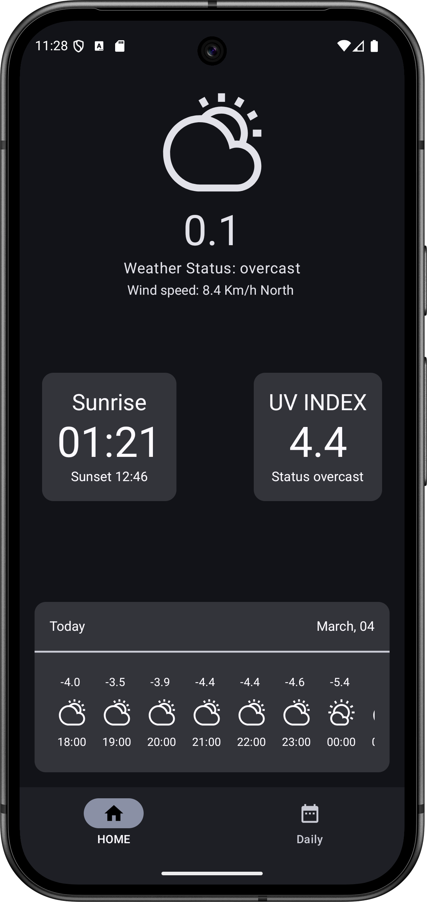
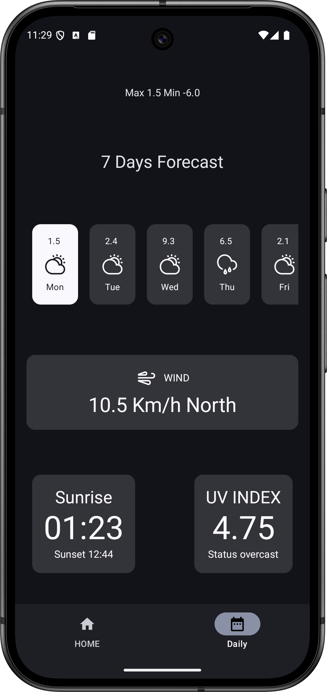

# Weather Api Demo
A Simple weather app that fetches pre-defined local area weather. Weather API comes from https://open-meteo.com/

# Features
* 100% Kotlin
* Kotlin Coroutines
* Dagger-Hilt
* ViewModel
* Retrofit
* Kotlin Serialization
* Clean Architecture

